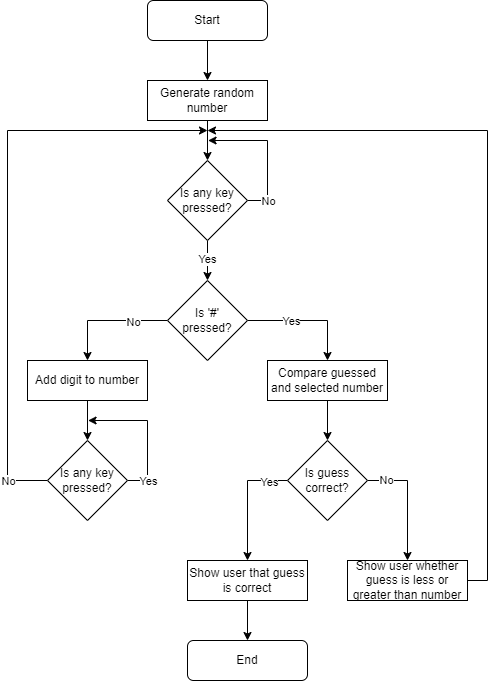

# Number Guessing Game
I do not want to develop this, but we have to do this for university...

## Table of Contents
1. [Algorithm](#algorithm)
2. [Setup](#setup)
    1. [Keypad](#keypad)

 

## Algorithm
This is the algorithm for the game:

 

## Setup
The following steps must be performed before running the program.

###### Keypad
The matrix keypad must be set up as follows:

