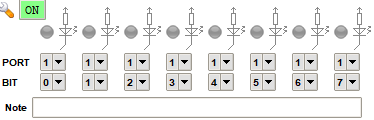
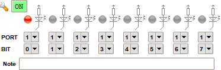
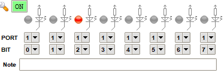
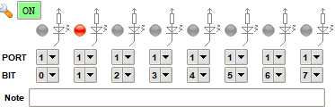

# Number Guessing Game
I do not want to develop this, but we have to do this for university...

 

## Table of Contents
1. [Algorithm](#algorithm)
2. [Setup](#setup)
    1. [Matrix Keypad](#matrix-keypad)
    2. [LED Panel](#led-panel)
3. [Output](#output)

 

## Algorithm
This is the algorithm for the game:

 

## Setup
The following steps must be performed before running the program.

###### Matrix Keypad
The matrix keypad must be set up as follows:

To do so, click on **Virtual HW > Matrix Keypad**. A new window opens. Click on the wrench symbol and select **Load configuration**. Select **hw/keypad.vhc** afterwards.

###### LED Panel
The LED panel must be set up as follows:

To do so, click on **Virtual HW > LED Panel**. A new window opens. Click on the wrench symbol and select **Load configuration**. Select **hw/led_panel.vhc** afterwards.

 

## Output
The follwoing section describes the output of the LED panel.

If the randomly generated number is **less than** the entered number, the first LED turns on:  

If the randomly generated number is **greater than** the entered number, the third LED turns on:  

If the randomly generated number is **equal to** the entered number, the second LED turns on:  

