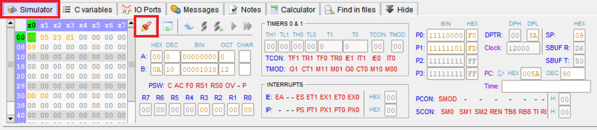
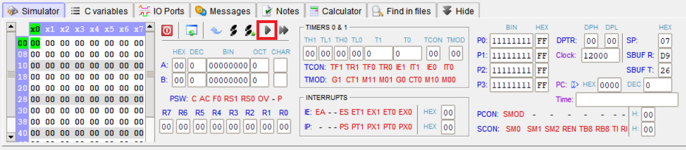

# Number Guessing Game

Simple number guessing game for the 8051 microprocessor written in Assembly.

###### Table of Contents
1. [Description](#description)
2. [How to Run the Project](#how-to-run-the-project)
3. [How to Use the Project](#how-to-use-the-project)
4. [Contributors](#contributors)
5. [License](#license)
6. [How to Contribute](#how-to-contribute)

 

## Description
The program generates a pseudorandom number. Afterwards, the user can enter a number (with multiple digits) through a matrix keypad. The program then compares the entered number and the randomly generated number and turns on one of three LEDs to inform the user whether the randomly generated number is less than, equal to or greater than the entered number.

###### Used Technologies
The program is developed with Assembly through the MCU 8051 IDE. The IDE can simulate the program as well as the virtual hardware used.

The random numbers are generated through a linear congruential generator (LCG).

###### General Algorithm
This is the general algorithm for the game:

 

## How to Run the Project

###### Open the Project
In order to run the project, you need to download and install the MCU 8051 IDE.

Afterwards, download the code from this repository or clone using `git clone https://github.com/Christian-2003/number-guessing-game`.

Next, open the project in MCU 8051 IDE by double-clicking the _NumberGuessingGame.mcu8051ide_ file. This should open the project.  
If this does not work, open the MCU 8051 IDE manually and go to **Project > Open**. Navigate to the project directory and select the _NumberGuessingGame.mcu8051ide_ file.

###### Setup Virtual Hardware
The program requres virtual hardware to run. Therefore, you need to setup the matrix keypad and LED panel.

To setup the matrix keypad, click on **Virtual HW > Matrix Keypad**. A new window opens. Click on the wrench symbol and select **Load configuration**. Select **hw/keypad.vhc** to load the configuration. Afterwards, the matrix keypad should look like this:

To setup the LED panel, click on **Virtual HW > LED panel**. A new window opens. Click on the wrench symbol and select **Load configuration**. Select **hw/led_panel.vhc** to load the configuration. Afterwards, the LED panel should look like this:

###### Run the Project
In order to run the project, click on **Simulator** in the bottom half of the window and click on the rocket symbol and compile the program:

Next click on the run symbol in order to run the program:

 

## How to Use the Project
###### Game Flow
After the project runs (as describes [here](#how-to-run-the-project)), you can use the project.

Enter a number on the matrix keypad by clicking on the first digit. Afterwards, release the key again. Repeat this for as many digits as you like.

Next, click on the `#`-key to submit the entered number. The program turns on one of the following LEDs to show you whether the randomly generated number is less than, equal to or greater than your entered number, as described [here](#led-panel-output).

If your entered number is not correct, release the `#`-key and begin entering a new number.

If your entered number is correct, release the `#`-key. A new random number is generated and you can continue the game.

###### LED Panel Output
If the randomly generated number is **less than** the entered number, the first LED turns on:  

If the randomly generated number is **greater than** the entered number, the third LED turns on:  

If the randomly generated number is **equal to** the entered number, the second LED turns on:  

 

## Contributors
The project is being developed by the following people:
* [Bjoern04](https://github.com/Bjoern04)
* [Christian-2003](https://github.com/Christian-2003)
* [JanWilfert](https://github.com/JanWilfert)
* [TimzWolf](https://github.com/TimzWolf)

 

## License
The project is licensed unter the terms and conditions of the MIT license. You can view a copy of the license [here](https://github.com/Christian-2003/number-guessing-game/blob/main/LICENSE.txt).

 

## How to Contribute
This is a project for university. Therefore, nobody besides the mentioned contributers are allowed to contribute to the project.

 

***

2024-06-06  
&copy; Christian-2003